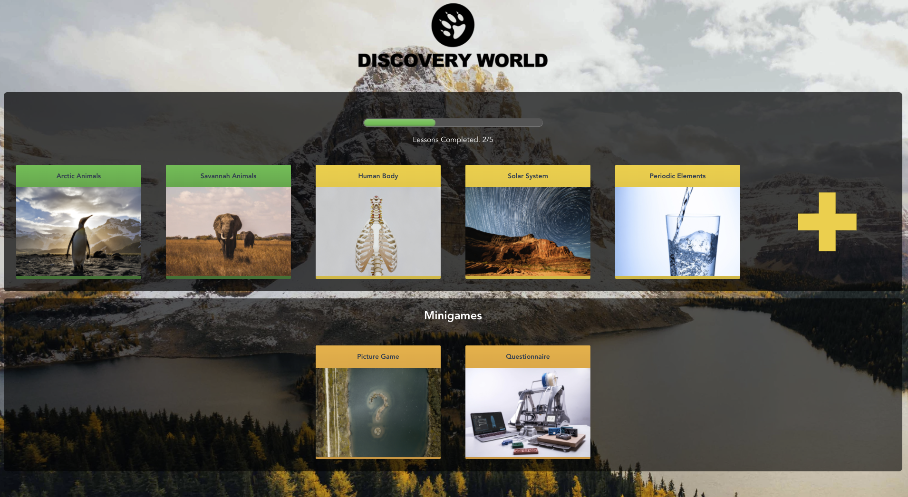
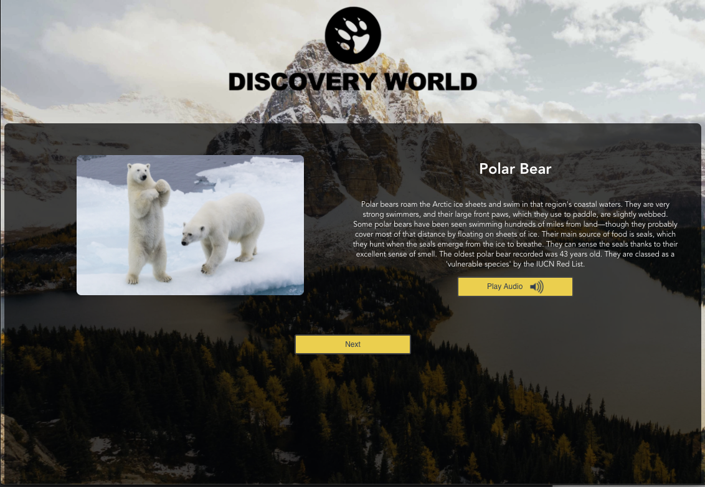
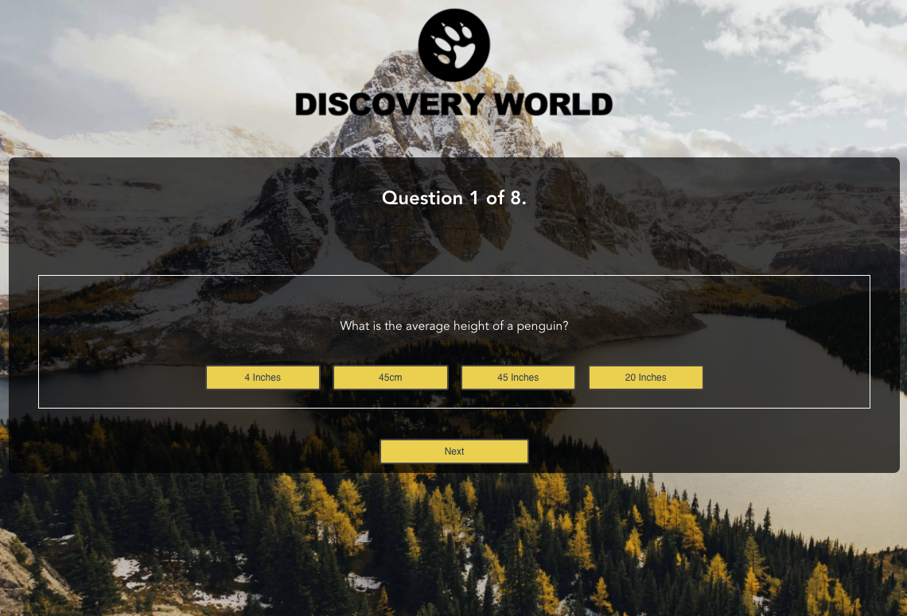

<p align="center">
  <image width="200px" src="client/public/logo.png" alt="discovery world logo">
</p>
  
# Discovery World Educational App

An educational app aimed towards kids that enjoy completing quizzes and minigames based on trivia. The app follows a progression system where each completed quiz counts towards the lesson completion progress bar.

## The Task
The task was to make an interactive browser application that displays information in a fun and interesting way. We were, as a group, to make a prototype to demonstrate this.

## The Objectives
* A user should be able to view some educationsla content on a particular subject
* The user should be able to interact with the page to move through different sections of content
* To work together, as a group of three, to plan, implement, test and showcase our prototype after a week.

## The app carries out the following
* All lessons are stored on a back end using a MongoDB database and an Express server
* A CMS system is in place to allow teachers to create, modify, update and delete lessons
* Subjects are displayed as cards on the home page for users to click on
* Each subject has multiple topics which the user can go through using navigation buttons
* Each topic has a button to play spoken audio of the topic.
* At the end of each lesson there is a multiple choice test for he user to play.
* Successfully completing tests unlock minigames to be played at any time
* A progress bar on the home page represents the percentage of all lessons completed


---
## Screenshots







**Programming Language**: JavaScript

**Front-End Web Framework**: Vue.js

**Back-End Web Framework**: Express

**DB**: MongoDb

**Markup/Styling**: HTML5/CSS3

# Setup

**In both client & server directories**

```
npm install
```

**In server directory**

```
npm run seeds
```
```
npm run server:dev
```

**In client directory**

```
npm run serve
```

**Click on the following link to view in browser**

http://localhost:8080/

# Created by

Alexander Gyllos,
Ashir Qureshi,
Jack Quigley
